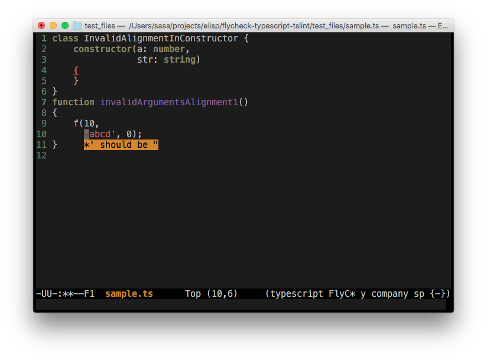

# flycheck-typescript-tslint

[](https://github.com/Simplify/flycheck-typescript-tslint/blob/master/COPYING)
[](http://melpa.org/#/flycheck-typescript-tslint)

This is extension for [Flycheck](http://www.flycheck.org/).
It uses [TSLint](https://github.com/palantir/tslint) - a linter for the TypeScript language and
warns you about stylistic and programming errors.



## Installation

### Melpa

Package in available on [Melpa](https://melpa.org/#/flycheck-typescript-tslint).

### Manual install

Just place flycheck-typescript-tslint.el somewhere on your system and load it.
You'll need to have flycheck and typescript-mode installed.

```cl
;; Replace ~/Projects/elisp/flycheck-typescript-tslint/ with your location.
(add-to-list 'load-path "~/Projects/elisp/flycheck-typescript-tslint/")
(load-library "flycheck-typescript-tslint")
```

## Usage

Add to your `init.el`:

```cl
(eval-after-load 'flycheck
  '(add-hook 'flycheck-mode-hook #'flycheck-typescript-tslint-setup))
```

### TSLint installation

Make sure that you have TSLint installed:

```
npm install -g tslint
npm instell -g typescript
```

If you can't install TSLint globally or can't put executable in $PATH:

```cl
(custom-set-variables
 '(flycheck-typescript-tslint-executable "~/my_executables/tslint"))')
```

### Options

#### Location of the config file

You can specify config file for tslint:

```cl
(custom-set-variables
 '(flycheck-typescript-tslint-config "~/tslint.json"))
```

Flycheck will try to find `tslint.json` even if you don't set this option.
Just add `tslint.json` in your project directory, or in your home directory,
Flycheck will find it.

**Just remember that `tslint` does not work without configuration file!**

#### Location of additional rules directory

You can also specify an additional rules directory, for user created rules.

```cl
(custom-set-variables)
 '(flycheck-typescript-tslint-rulesdir "~/my-tslint-rules")
```

For more details please check [TSLint CLI usage](http://palantir.github.io/tslint/usage/cli/).

## License

This program is free software: you can redistribute it and/or modify it under
the terms of the GNU General Public License as published by the Free Software
Foundation, either version 3 of the License, or (at your option) any later
version.

This program is distributed in the hope that it will be useful, but WITHOUT ANY
WARRANTY; without even the implied warranty of MERCHANTABILITY or FITNESS FOR A
PARTICULAR PURPOSE.  See the GNU General Public License for more details.

You should have received a copy of the GNU General Public License along with
this program.  If not, see [http://www.gnu.org/licenses/](http://www.gnu.org/licenses/).
